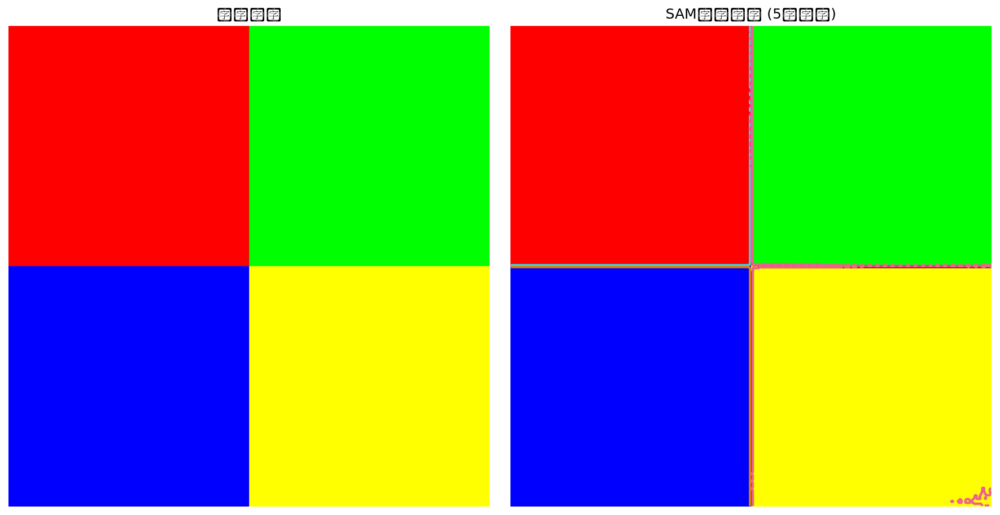

# SAM图像分割实验项目

基于Meta SAM（Segment Anything Model）的图像分割实验项目，持续迭代中。

## 我的相关比赛经历

- **2025年中国高校计算机大赛—移动应用创新赛**：基于SAM和DeAOT的马赛克自动追踪装置（**三等奖**）
- **全国三维数字化创新设计大赛18周年精英联赛**：变电站巡检机器人（**海南赛区二等奖**）

## 技术栈

Python | OpenCV | PyTorch | Segment Anything (SAM) | 计算机视觉

## 快速开始

```bash
# 安装依赖
pip install git+https://github.com/facebookresearch/segment-anything.git
pip install opencv-python matplotlib numpy

# 运行示例
python demo.py

## 实验效果



上图展示了SAM模型对测试图片的自动分割结果，不同颜色轮廓代表检测到的不同对象区域。
